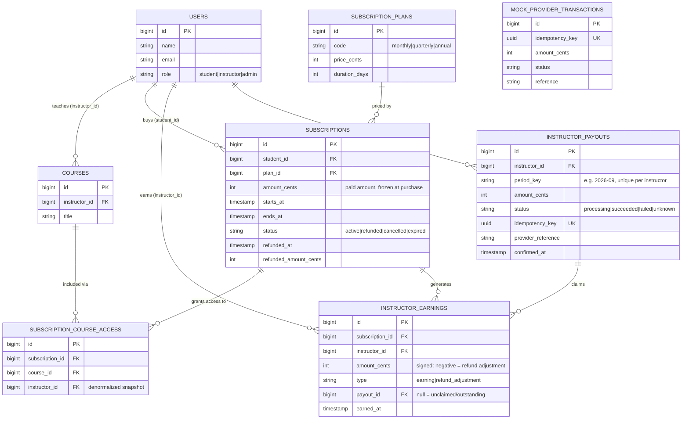

# Architecture

## Entity-Relationship Diagram

## Layering: Controller → Service → Action

Three distinct layers, each with one job:

- **Actions** (`app/Actions`) are the smallest unit: one action, one
  transaction, one piece of money-affecting logic
  (`AllocateSubscriptionRevenueAction`, `ProcessRefundAction`). They take
  Eloquent models in, don't know about HTTP, and are unit-tested directly
  with no framework request cycle involved.
- **Services** (`app/Services`) orchestrate. `SubscriptionService` turns "a
  student wants plan X with access to courses [1,2,3]" into the DB writes
  plus a call to the right Action, inside one transaction. Read-side queries
  (an instructor's balance, their payout history) live in
  `InstructorLedgerService` rather than being written independently by
  whichever consumer needs them — all consumers call
  `allBalancesQuery()`/`balance()`, so
  there's exactly one definition of "outstanding balance" in the codebase.
  `InstructorPayoutService` is the exception worth calling out: it's a
  Service, not an Action, specifically because it needs to hold state across
  a provider call that can throw partway through (claim → attempt payment →
  handle three different outcomes) — that's orchestration, not a single
  atomic unit of business logic.
- **Controllers** (`app/Http/Controllers/Api`) do three things and nothing
  else: validate input via a Form Request, call exactly one Service method,
  return an API Resource. No `DB::transaction`, no business rule, no direct
  Eloquent writes ever appear in a controller in this codebase — if a review
  question is "where would you add rule X", the answer should always be a
  Service or an Action, never a controller.

**Deliberate omission:** there is no HTTP endpoint to trigger a payout run.
Moving real money is only ever initiated by `php artisan payouts:run`
(scheduled, or run manually by an operator with shell/CI access) — never by
an arbitrary authenticated request. Keeping the one thing that actually
disburses funds behind a single, auditable trigger point is a deliberate
security/operational decision, not an oversight.

## Revenue allocation strategy

**When money counts as earned.** Full recognition happens the moment the
subscription payment is captured, not spread ratably over the term. The
alternative — recognising, say, 1/30th of a monthly subscription's revenue
each day it's "live" — is arguably more correct from an accounting
standpoint (it matches the earning to the delivery of the service), but it
requires a scheduled per-subscription-per-day job and materially complicates
both the allocation logic and the refund logic (you'd be reversing *future
scheduled* recognitions instead of a single already-created row). For the
scope of this exercise I chose immediate, one-time recognition and handle
"the student left early" via the refund adjustment path instead. This is the
single biggest judgment call in the system and I expect to be asked to
defend or extend it live.

**How a payment is split.** `AllocateSubscriptionRevenueAction`:
1. Snapshots which instructors are included via `subscription_course_access`
   (captured once, at purchase time — not derived live from the catalog, so
   a subsequent change to an instructor's course list can never retroactively
   change how a past payment was split).
2. Computes the instructor pool = `amount_cents * (100 - platform_cut) / 100`,
   rounded to the nearest cent.
3. Splits that pool across instructors with integer floor-division, then
   hands the leftover cents (at most `count - 1` of them) to instructors in
   ascending `instructor_id` order.

**Rounding trade-off.** Floor-division-plus-remainder guarantees the sum of
instructor earnings for a payment always equals the pool exactly — no cent
is ever lost or invented. The cost: the lowest-ID instructor in a bundle
receives the extra cent slightly more often over time than their
co-instructors. A fairer-over-time alternative would rotate the starting
instructor (e.g. by `subscription_id % count`) or use the largest-remainder
method with a stable tie-break. I picked the simpler, more auditable version
for this exercise and would revisit it if instructors ever compared payslips
and asked why.

## Idempotency approach

Two independent mechanisms, deliberately redundant with each other:

1. **Claiming.** `InstructorPayoutService::claimOutstandingEarnings()` runs
   inside a DB transaction with `lockForUpdate()` on both the earnings being
   claimed and any existing payout row for that instructor+period. Once an
   earning's `payout_id` is set, there is nothing left for a second,
   concurrent caller to claim — the query that finds "unclaimed earnings"
   simply returns fewer or zero rows.
2. **Uniqueness at the database level.** `instructor_payouts` has a unique
   constraint on `(instructor_id, period_key)`. Even if two processes race
   past the application-level check at exactly the same instant, only one
   `INSERT` can succeed; the loser is caught and treated as "someone else
   already handled this period" — not an error.

On top of that, `ProcessInstructorPayoutJob` implements `ShouldBeUnique`
keyed by `instructor_id` + `period_key`, so Laravel's queue layer refuses to
even enqueue a duplicate job while one is in flight — a first line of
defence before the two DB-level mechanisms are ever reached.

This is why:
- Running `payouts:run` twice (overlapping schedule, manual re-trigger) is
  safe: the second run's `claimOutstandingEarnings` call finds either an
  existing payout row (no-op) or zero unclaimed earnings.
- A retried job after a worker crash is safe for the same reason — retrying
  re-enters `claimOutstandingEarnings`, which is itself idempotent.
- Two servers running the scheduler simultaneously is safe: the unique
  constraint is the tie-breaker, not application-level locking, which
  wouldn't hold across two separate processes/servers anyway.

## Provider timeout handling

The mock provider (`MockPaymentProvider`) simulates three outcomes on
`charge()`:
- **Succeeds and tells us** (the common case).
- **Fails and tells us** — safe to react to immediately.
- **Succeeds on the provider's side, but the response is lost** (a thrown
  `PaymentProviderTimeoutException`). This is the dangerous case: we cannot
  tell the difference between "it failed" and "it succeeded but we didn't
  hear back" from the exception alone.

On a timeout, the payout is marked `unknown` — **not** `failed`, and its
earnings are **not** released. Releasing them would let a subsequent run
create a second payout for the same money, which is exactly the double-pay
scenario the brief warns about; if the first charge actually went through,
that second payout would be a real duplicate payment. Instead, a
`ReconcilePayoutStatusJob` is queued (with a delay) to ask the provider
`checkStatus(idempotencyKey)` later. That job:
- Marks the payout `succeeded` if the provider now confirms success.
- Releases the earnings and marks `failed` if the provider now confirms
  failure (so the money re-enters the pool for the next payout run).
- Re-queues itself with backoff if the provider still hasn't settled.

A payout only ever leaves the `unknown` state once reconciliation gets a
definitive answer — the system never guesses.

## Refunds

`ProcessRefundAction` computes the unused proportion of the term on a
straight-line elapsed-time basis and writes a **new**, negative
`refund_adjustment` ledger row per affected instructor — the original
`earning` row is never edited or deleted, so the ledger stays a true,
append-only history of what was allocated and when.

If the instructor's original earning was already paid out, this reversal
still gets recorded, but it isn't reconciled against that specific payout —
doing so would mean trying to claw back money that may have already left the
platform's account, which is a much harder (and riskier) problem than this
exercise's scope. Instead, the negative entry sits in the ledger unclaimed
(`payout_id IS NULL`) and is netted against the instructor's *future*
earnings the next time a payout runs, since `claimOutstandingEarnings` sums
all unclaimed rows — positive and negative — before deciding what to pay.
The visible consequence: an instructor can see a $0 (or reduced) payout in a
later period while an earlier refund is absorbed. I consider this an
acceptable, clearly-documented trade-off rather than a bug; a production
system serving real clawback obligations would likely need a formal
"instructor owes platform" balance and a separate recovery flow.

## Scaling considerations (500k subscriptions, tens of millions of rows)

- `instructor_earnings` is append-only and indexed on `(instructor_id,
  payout_id)` — the exact shape of the "what's outstanding" query — and on
  `(subscription_id, type)` for allocation/refund idempotency checks.
- The payout command never loads the full ledger into memory: it selects
  **distinct instructor IDs** with outstanding earnings and `chunk()`s
  through them, dispatching one lightweight job per instructor rather than
  processing everything in a single process.
- Each `ProcessInstructorPayoutJob` only touches one instructor's rows, so
  the work parallelises trivially across as many queue workers as needed.
- At true scale, `instructor_earnings` is the table most likely to need
  partitioning (e.g. by month) or periodic archival of fully-claimed rows
  older than N periods into a cold table, since it's the one growing
  unboundedly with subscription volume.

## Known limitations

- Revenue is recognised immediately rather than ratably — see above.
- Refund clawbacks against already-paid instructors are absorbed against
  future earnings rather than actively recovered.
- The mock provider's "ground truth" table (`mock_provider_transactions`)
  is a simplification of a real payment gateway's webhook/status-check API;
  a production integration would likely also need webhook signature
  verification and a dead-letter queue for reconciliation jobs that never
  resolve.

## Senior bonus (discussion only): mid-term plan upgrades

The brief asks specifically about a student upgrading partway through an
annual subscription, with a fair price adjustment, without requiring an
implementation. My approach:

1. **Compute a prorated credit** for the unused portion of the current plan,
   the same way `ProcessRefundAction` already does (elapsed-time ratio ×
   `amount_cents`). This is intentionally the same math, reused rather than
   reinvented.
2. **Do not touch the original subscription's earnings.** Leave the
   original allocation exactly as it stands (it was correct for the money
   actually received at the time). Instead, create the same
   `refund_adjustment` reversal the refund path already produces, sized to
   the unused portion — conceptually, an upgrade is "refund the unused part
   of the old plan, then buy a new one."
3. **Create a new subscription row** for the new plan, priced at
   `new_plan_price - unused_credit` (never negative; floor at zero, and
   decide as a business rule whether a negative remainder becomes a wallet
   credit or is simply forfeited — I'd lean toward wallet credit for
   fairness, but that's a product decision, not an engineering one).
4. **Re-run `AllocateSubscriptionRevenueAction` against the new subscription**
   as normal — same idempotency guarantees apply, no special-casing needed
   in the allocation or payout logic.
5. The old subscription's `status` becomes `cancelled` (distinct from
   `refunded`, since no cash left the platform — it was converted, not
   returned) with a link (e.g. `superseded_by_subscription_id`) to the new
   one, purely for audit/support traceability.

This reuses every idempotency and ledger guarantee already built — no new
double-pay surface is introduced, because it's built entirely out of two
already-safe primitives (a refund-shaped reversal, and a normal new
allocation).
